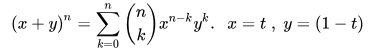
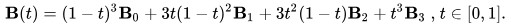

# Instalação & Execução

Método para funcionamento no Ubuntu:

Primeiro é preciso instalar o gerenciador de pacotes do python o PIP:

$ sudo apt update
$ sudo apt install python3-pip

Logo após a instalação do PIP, clonar o repositório no diretório de trabalho:

$ sudo apt update
$ sudo apt install git
$ git clone https://github.com/GeovaneF55/bezier.git [caminho/para/repositorio]

Será necessário, em seguida, navegar até a pasta raíz do projeto e instalar as dependências necessárias para a execução do programa (numpy, pyqt5):

$ cd caminho/para/repositório/bezier
$ sudo pip3 install -e .

Ao instalar as dependências e estando dentro da pasta raíz do projeto, vá para a pasta bezier e lá execute:

$ python3 bezier.py

# Curva de Bêzier:

É uma curva polinomial expressa como a interpolação linear entre alguns pontos representativos, chamados de pontos de controle. Esse tipo de curva também pode originar Superfícies de Bézier, bastante utilizadas em modelagem tridimensional, animações, design de produtos, engenharia, arquitetura entre outras aplicações.

Ela foi desenvolvida em 1962 e seu nome é devido a quem publicou o primeiro trabalho sobre a curva, o francês Pierre Bézier, funcionário da Renault, que a usou para o design de automóveis. Ela foi estruturada a partir do algoritmo de Paul de Casteljau, da Citroën, em 1957, e foi formalizada na década de 60.

A curva baseia seu cálculo no Binômio de Newton para a resolução de seus coeficientes e é resolvida facilmente através de:

O índice t é um valor de parametrização para percorrer a curva e pode ser qualquer valor entre zero e um, n é o grau do Binômio, tal que usamos n+1 pontos de controle para cada curva que desejamos desenhar. (n k)são coeficientes binomiais. 

A curva implementada foi a Curva de Bêzier Cúbica:

# Como Utilizar (Manual do Usuário):

No menu superior temos os seguintes botões:

    1. Arquivo

    • Curvas Paramétricas de Bêzier: Ao clicar você poderá definir 4 pontos como parâmetros para a curva de Bêzier que será plotada logo em seguida.
    • Limpar: Ao clicar em limpar a curva de Bêzier aparente na tela será apagada.
    • Sair: Ao clicar em sair, o programa terminará

    2. Ver

    • Ver Barra de Status: Habilita/Desabilita a barra de status do programa na parte inferior do programa

Na  Toolbar superior temos os mesmos botões do menu superior do grupo de Arquivo

# Organização do Código:

O Código contém as seguintes classes:

    • Drawer
    • MyWidget
    • MyPaint

O algorítmo de Bêzier foi implementado pelo metodo de mesmo nome e foi utilizado os cálculos da matriz de bêzier para descobrir os valores constantes da função que define a curva.
